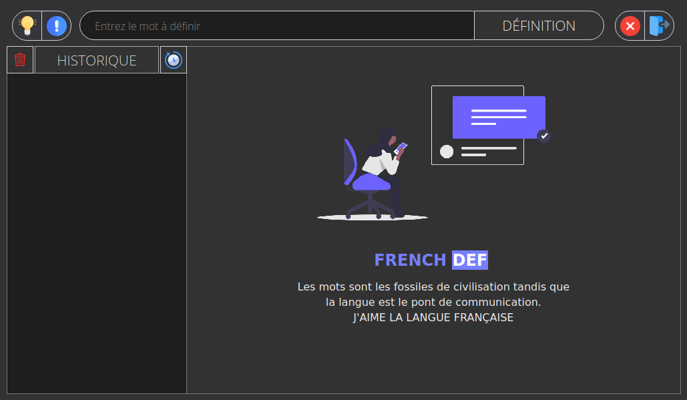

# FRENCH-DEF
French dictionary

## INSTALL REQUIREMENTS

```BASH

pip install -r requirements.txt

```

<br/>

## EXECUTE

```BASH

python main.py

```

<br/>

## COMPILE RESSOURCE FILE

```BASH

pyrcc5 -o res_rc.py res.qrc

pyuic5 -o ui/home.py interface/home.ui

pyuic5 -o ui/about.py interface/about.ui

```

<br/>

## PREVIEW

<br/>


<br/>


<br/>

### DARK MODE



<br/>
